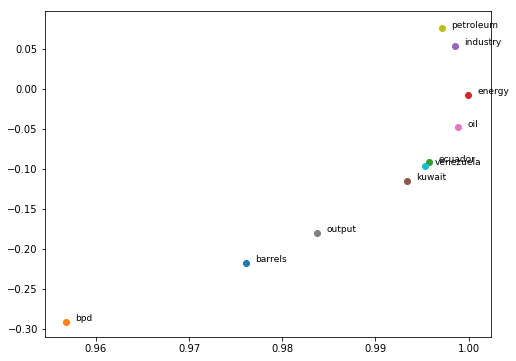
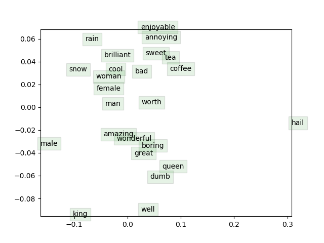

# CS224n
CS224n: Natural Language Processing with Deep Learning Assignments Winter, 2019

#### Requirements
* Python 3.5+
* Pytorch

## Assignment 1 
### Basic embedding technics

1. Count-Based Word Vectors: Co-Occurrence Word Embeddings and Matrix, SVD for its dimentional reduction.

2. Prediction-Based Word Vectors: word2Vec.

3. Cosine Similarity and Distance: searching Polysemous Words, Synonyms and Analogies, Bias.  

## Assignment 2
### Word2Vec's losses and gradients 
#### All information is in assignment_2/writting_assignment_and_instructions.pdf

1. Sigmoid function, softmax, negative sampling loss and gradient functions' implementations.
2. SGD implementation.
3. Training word vectors, and later applying them to a simple sentiment analysis task using Stanford Sentiment Treebank (SST) dataset. 

## References

YouTube playlist with lectures:
* https://www.youtube.com/playlist?list=PLoROMvodv4rOhcuXMZkNm7j3fVwBBY42z

CS224n official website:
* http://web.stanford.edu/class/cs224n/index.html#schedule
