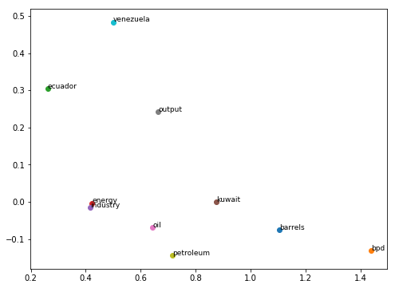

# CS224n
CS224n: Natural Language Processing with Deep Learning Assignments Winter, 2019

#### Requirements
* Python 3.5+
* Pytorch

# Assignment 1 
### Basic embedding technics

1. Count-Based Word Vectors: Co-Occurrence Word Embeddings and Matrix, SVD for its dimentional reduction.\

2. Prediction-Based Word Vectors: word2Vec.\
\
3. Cosine Similarity and Distance: searching Polysemous Words, Synonyms and Analogies, Bias.

# Assignment 2
### Word2Vec's losses and gradients 
#### All information is in assignment_2/writting_assignment_and_instructions.pdf

1. Sigmoid function, softmax, negative sampling loss and gradient functions' implementations.
2. SGD implementation.
3. Training word vectors, and later applying them to a simple sentiment analysis task using Stanford Sentiment Treebank (SST) dataset.\

# Assignment 3
### Parsing and Modeling
#### All information is in assignment_3/a3.pdf
Dependency parsing:
  1. Transition-based parsing (Stack + buffer)
  2. Malt parser performed by dense Neural Net and Word Embedding

# Assignment 4
### Word-level Neural Machine Translation
#### Spanish-to-English translation
#### All information about architecture is in assignment_4/a4.pdf
Model is based on:
  1. LSTM
  2. Attention

Results of testing:\

# Assignment 5
### Charactter-level Neural Machine Translation
#### Spanish-to-English translation
#### All information about architecture is in assignment_5/a5.pdf
Model is based on previous assignment. Differences:
  1. Character-level embedding for encoder
  2. Character-level decoding for <UNK> words

Results of testing:\

# Final Project
### In progress

## References

YouTube playlist with lectures:
* https://www.youtube.com/playlist?list=PLoROMvodv4rOhcuXMZkNm7j3fVwBBY42z

CS224n official website:
* http://web.stanford.edu/class/cs224n/index.html#schedule
